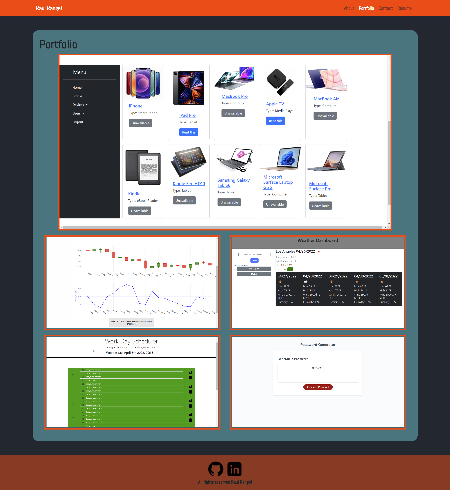
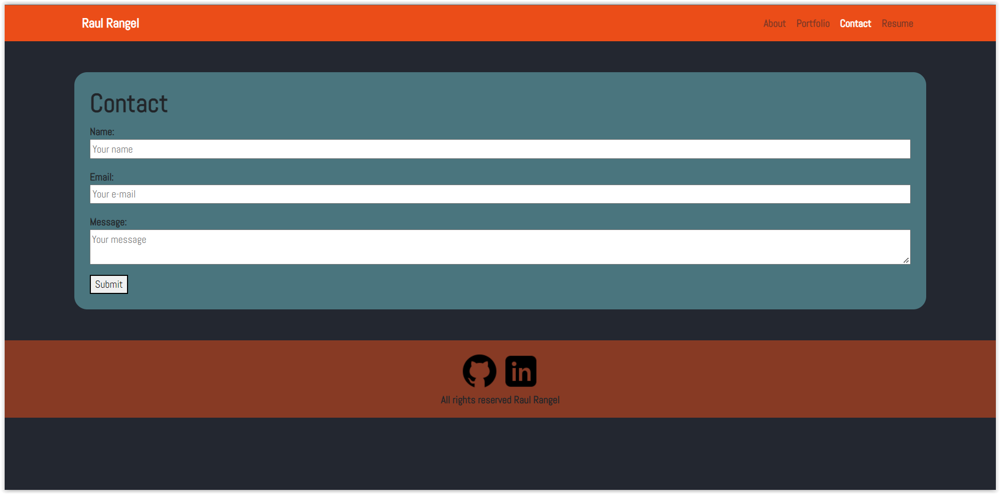
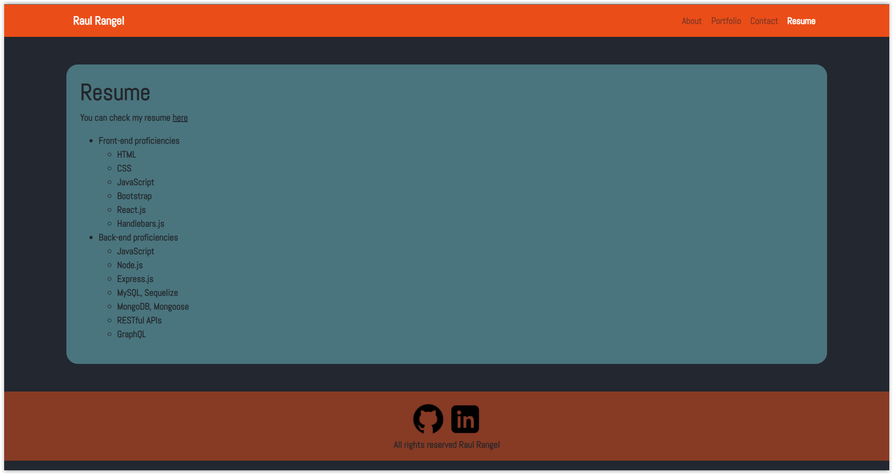

# React-Professional-Portfolio 

## Description

The motivation for this one was to create a responsive professiona portfolio using React.js

[Deployed Link](https://rrangel07.github.io/React-Professional-Portfolio/)

## Table of Contents

  - [Installation](#installation)
  - [Usage](#usage)
  - [Credits](#credits)
  - [License](#license)

## Installation

-No installation required

## Usage

For employers and anybody to check my previous developments.

## Tests

No tests provided for this app.

## License

This code is under MIT License license. In order to know what you can and can't do with this code, we recommend to visit the following link [MIT License](https://opensource.org/licenses/MIT).

## Questions

You can contact me through email at raulanrangel07@gmail.com.
Also, through my [GitHub Profile](https://github.com/rrangel07)
